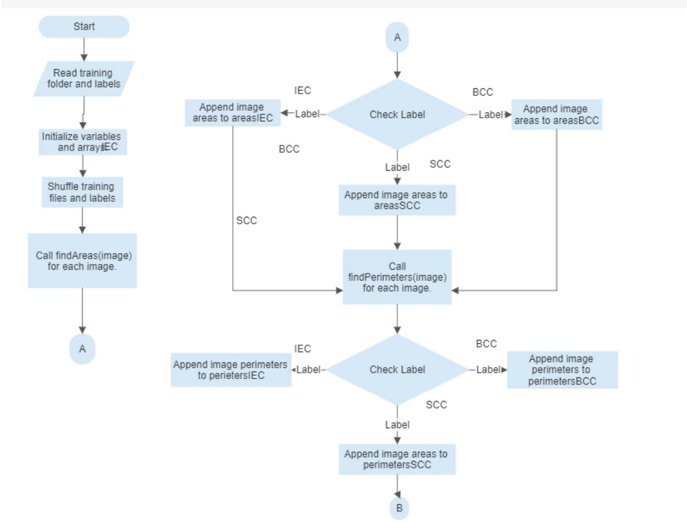
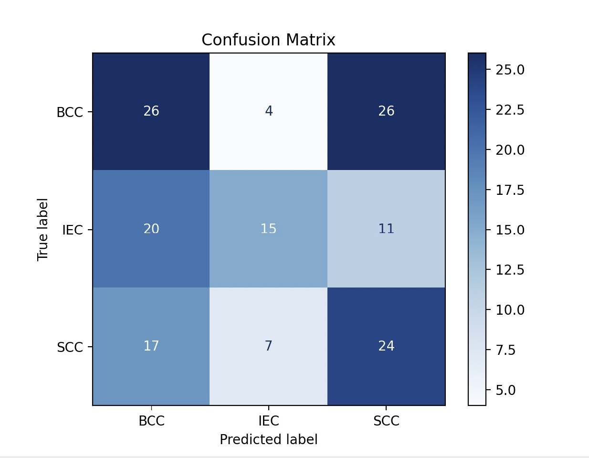

# Skin Cancer Classification using Deep Learning

## Project Objective

The goal of this project was to develop a framework capable of:
-  Segmenting all **12 types of tissue pixels** in medical images.
-  Classifying an image **patch into one of three classes**.

This project combined concepts from:
- Digital Image Processing  
- Deep Learning (U-Net)  
- Mathematical feature engineering  
- Classical classification algorithms

---

##  Methodology

### 🔹 1. Image Segmentation

- **Architecture**: U-Net based Convolutional Neural Network
- **Dataset Split**: 90% training / 10% testing
- **Preprocessing**:
  - Converted pixel colors to class indexes
- **Training**:
  - Trained for 150 epochs until stable accuracy was achieved
- **Evaluation**:
  - Confusion matrix for segmentation performance
- **Output**:
  - Masked segmentations saved in the `Outputs/` folder

### 🔹 2. Feature Extraction

- **24 Features**:
  - 12 areas (one for each tissue type)
  - 12 perimeters (one for each tissue type)
- **Steps**:
  - Area: Count class-colored pixels
  - Perimeter: Convert masks → binary images → find contours → sum perimeters

### 🔹 3. Image Classification

- **Approach**:
  - Calculate mean feature vectors for each of the 3 classes
  - Use Euclidean distance to assign test image to the nearest class

📈 **Classification Flow**

---

## 📊 Results

-  **Accuracy**: 43.33%
-  **Metric**: Confusion Matrix
-  **Test Set**: Used provided labeled test data

📸 **Confusion Matrix Example**

